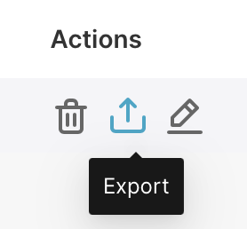
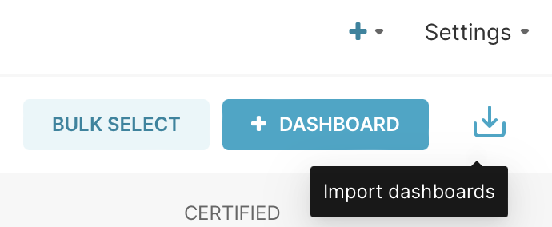
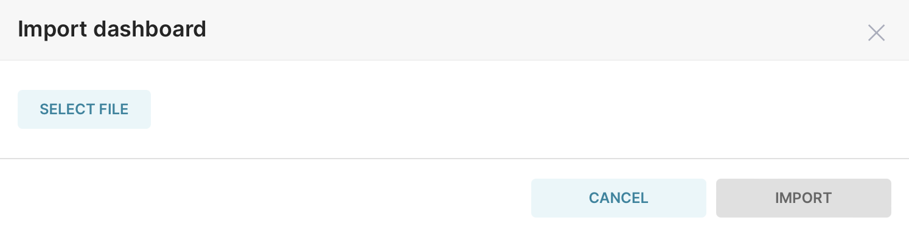
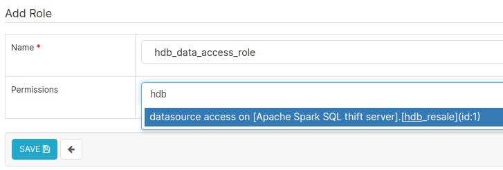
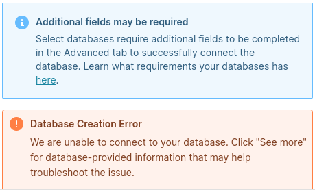

Superset in vbrani
===
1. To host Superset in vbrani without OAUTH
2. To host Superset in vbrani with OAUTH

### Usage Instructions
#### 1. Deploy Superset with Ingress 
```
helm upgrade superset superset/superset --install --values values_withIngress.yaml --namespace batch11-dataops-playground
```
Outcome:
```
NAME: superset
LAST DEPLOYED: MM DD HH:MM:SS YYYY
NAMESPACE: batch11-dataops-playground
STATUS: deployed
REVISION: 1
TEST SUITE: None
NOTES:
1. Get the application URL by running these commands:
  https://superset.vbrani.aisingapore.net/
```

#### 2. Deploy Superset with Ingress and OAUTH
Please update the following fields in values_withIngress_OAUTH.yaml before run the following command.
```
extraSecretEnv:
  GOOGLE_KEY: ToBeUpdated
  GOOGLE_SECRET: ToBeUpdated
  MAPBOX_API_KEY: ToBeUpdated
```
```
helm upgrade superset superset/superset --install --values values_withIngress_OAUTH.yaml --namespace batch11-dataops-playground
```
Outcome:
```
NAME: superset
LAST DEPLOYED: MM DD HH:MM:SS YYYY
NAMESPACE: batch11-dataops-playground
STATUS: deployed
REVISION: 1
TEST SUITE: None
NOTES:
1. Get the application URL by running these commands:
  https://superset.vbrani.aisingapore.net/
```

#### 3. Connect to database
The current deployment is connected to an Apache Spark SQL database server.

To connect to other databases, please refer to the [official Apache Superset docs](https://superset.apache.org/docs/databases/installing-database-drivers) to check for PyPI dependencies and connection string format.

#### 4. Export Superset Dashboard, Chart and Dataset
Go to the Dashboards list page, from the "Actions" columns of to-be-exported dashboard, click "Export" button. The Dashboards, its Charts and its Datasets will be exported together.



#### 5. Import Superset Dashboard, Chart and Dataset
5.1 Go to the Dashboards list page, from the right top cornor, click "Import Dashboards" button. The Dashboards, its Charts and its Datasets will be imported together.



5.2 
Choose the file that going to be imported and click "IMPORT" button. The dashboards will be imported after that.



#### 6. Role-Based Access Management
Roles can be configured in ```Settings > List Roles > +```.

Superset comes with several predefined roles as described in the [official documentation](https://superset.apache.org/docs/security/).

The "Gamma" role can be used as a basic template for new roles. Thereafter, datasource accesses can be granted to roles to restrict access to specific datasets, which in turn restricts what users with that role can view in dashboards.


#### 7. Uninstall Superset with Helm
```
helm uninstall superset --namespace batch11-dataops-playground
```

### Known Issues
* Database connection error message:



